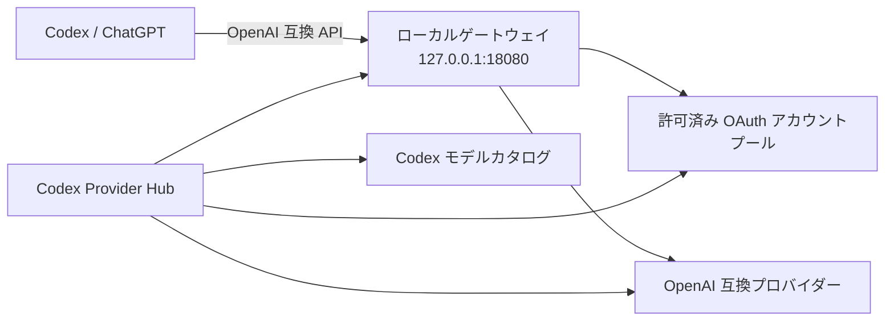

<p align="center">
  
</p>

<p align="center">
  <a href="README.md">English</a> ·
  <a href="README.zh-CN.md">简体中文</a> ·
  <a href="README.ja.md"><strong>日本語</strong></a>
</p>

<p align="center">
  <a href="https://github.com/ningsam/codex-provider-hub/actions/workflows/ci.yml"></a>
  <a href="https://github.com/ningsam/codex-provider-hub/releases"></a>
  <a href="LICENSE"></a>
  
  <a href="https://github.com/ningsam/codex-provider-hub/stargazers"></a>
</p>

# Codex Provider Hub

**Codex のプロバイダー、OAuth アカウントプール、モデルルーティング、利用枠を一元管理する、ローカルファーストの macOS コントロールプレーンです。**

Codex Provider Hub は、ローカルの [Sub2API](https://github.com/Wei-Shaw/sub2api) 環境をネイティブなメニューバーワークスペースから操作できるようにします。ゲートウェイの起動・停止、OpenAI 互換プロバイダーの追加、アカウントごとの利用枠確認、ChatGPT のモデルピッカー保護、Cursor やリレーサービスの利用状況確認を、認証情報をクラウドの管理画面へ送らずに行えます。

<p align="center">
  <a href="https://github.com/ningsam/codex-provider-hub/releases"><strong>macOS プレビュー版をダウンロード</strong></a>
  ·
  <a href="#ソースからビルド">ソースからビルド</a>
</p>

> [!IMPORTANT]
> 本プロジェクトは初期段階の macOS 向けプレビューです。配布物は ad-hoc 署名されていますが、Apple の notarization はまだ行われていません。初回起動時に **システム設定 → プライバシーとセキュリティ** で許可が必要になる場合があります。
>
> 本プロジェクトは非公式のコミュニティプロジェクトであり、OpenAI、ChatGPT、Cursor、AIHub、Sub2API からの承認・提携を受けたものではありません。自分が所有している、または管理権限を持つアカウントとプロバイダーのみを使用してください。

## プレビュー

<p align="center">
  
</p>

## このプロジェクトが解決すること

ローカルのマルチプロバイダー環境では、Shell スクリプト、Docker、設定ファイル、アカウント管理画面、モデルカタログに操作が分散しがちです。Codex Provider Hub はそれらを一つの可視化ワークスペースへまとめ、機密データは Mac の中に保持します。

| 機能 | 得られるもの |
| --- | --- |
| **ローカルゲートウェイ制御** | `127.0.0.1:18080` の Sub2API ゲートウェイを起動・停止・更新し、ヘルスチェックできます。 |
| **プロバイダー追加** | OpenAI 互換アップストリームを追加し、モデルを検出して Codex カタログへ同期します。 |
| **OAuth アカウントプール** | 許可済みの OpenAI/Codex OAuth アカウントを取り込み、5 時間 / 7 日間の利用枠を確認します。 |
| **モデルピッカーガード** | ローカルの `use_hidden_models` 状態を修復し、host rules 付きで ChatGPT を再起動できます。 |
| **リレー利用状況** | AIHub の残高と当日の使用量を同じダッシュボードで確認します。 |
| **Cursor アカウント表示** | ローカルの Cursor セッション、または許可済みトークンを追加して利用量を確認します。 |
| **ネイティブなメニューバー操作** | メニューバー項目の直下に、コンパクトで透明なリキッドグラス画面を開きます。 |

## プレビュー版のインストール

1. [GitHub Releases](https://github.com/ningsam/codex-provider-hub/releases) を開きます。
2. Mac に合う `.dmg` をダウンロードします。
   - Apple Silicon: `aarch64`
   - Intel: `x86_64`
3. **Codex Provider Hub.app** を Applications に移動します。
4. `SUB2API_DIR` または `CODEX_PROVIDER_HUB_SUB2API_DIR` で既存の Sub2API ディレクトリを指定します。

プレビュー版は ad-hoc 署名です。macOS により起動がブロックされた場合は、**システム設定 → プライバシーとセキュリティ** から **このまま開く** を選択してください。自動リリースには `SHA256SUMS.txt` が含まれます。

## 構成



Codex Provider Hub はコントロール層です。ローカルのルーティング層である Sub2API は別途インストールします。

## 必要環境

- macOS 11 以降
- `./sub2api` 管理スクリプトを含む、動作済みのローカル Sub2API 環境
- モデルピッカーガードの任意依存: Python 3 と `plyvel`
- ソースからビルドする場合のみ Node.js 20+ と Rust stable

## ソースからビルド

```bash
git clone https://github.com/ningsam/codex-provider-hub.git
cd codex-provider-hub
npm install

export SUB2API_DIR="$HOME/path/to/your/sub2api-ready"
npm run tauri dev
```

ローカルバンドルを作成する場合:

```bash
npm run tauri build
```

<details>
<summary><strong>設定リファレンス</strong></summary>

| データソース | 認証情報またはパス |
| --- | --- |
| Sub2API ディレクトリ | `SUB2API_DIR` または `CODEX_PROVIDER_HUB_SUB2API_DIR`。未指定時は `$HOME/Documents/Codex/sub2api-ready` |
| ゲートウェイ API Key | `$SUB2API_DIR/state/gateway-api-key` |
| Sub2API 管理者 | `$SUB2API_DIR/.env` の `ADMIN_EMAIL` と `ADMIN_PASSWORD` |
| AIHub Key | Sub2API の AIHub アカウント、アプリ内保存 Key、`ANYROUTER_API_KEY` / `~/.zshrc` の順で参照 |
| Codex 設定 | `~/.codex/config.toml` と Codex model catalog JSON |
| Cursor Token | アプリデータディレクトリへ暗号化保存、または Cursor の `state.vscdb` からインポート |

</details>

## セキュリティモデル

- API Key をリポジトリのソースコードへハードコードしません。
- Cursor と AIHub のカスタム認証情報は AES-256-GCM で暗号化して保存します。
- プロバイダー認証情報はローカルの検出処理または Sub2API 設定にのみ使用し、ブラウザストレージへ保存しません。
- Codex 設定と model catalog を変更する前にバックアップします。
- 機密性のある報告は [SECURITY.md](SECURITY.md) に従ってください。公開 Issue に API Key、OAuth token、JWT、未編集の `.env` を投稿しないでください。

本ツールは許可済みリソースを表示・ルーティングするもので、プロバイダーの利用枠や利用規約を回避するものではありません。

## リリースと品質管理

- 各 Pull Request で TypeScript/Vite ビルドと Apple Silicon 向けネイティブ Tauri バンドルを検証します。
- 管理用の `release` ブランチへの push で Apple Silicon / Intel の両方をビルドします。
- 成果物は SHA-256 チェックサム付きの GitHub prerelease として公開します。
- Developer ID 署名と Apple notarization は次の配布マイルストーンです。

[CHANGELOG.md](CHANGELOG.md) と [ROADMAP.md](ROADMAP.md) も参照してください。

## コントリビューション

パッケージング、ローカライズ、初回セットアップ、プロバイダー互換性、macOS テストへの貢献を歓迎します。Pull Request を作成する前に [CONTRIBUTING.md](CONTRIBUTING.md) を確認してください。

バグ報告と機能提案には、リポジトリの [Issue テンプレート](https://github.com/ningsam/codex-provider-hub/issues/new/choose) を利用してください。

## プロジェクトを応援する

Codex Provider Hub がローカル環境の管理に役立った場合は、リポジトリへの Star を検討してください。プロジェクトを必要とする開発者が見つけやすくなり、今後の優先順位を判断する材料にもなります。

## License

[MIT License](LICENSE) の下で公開しています。
