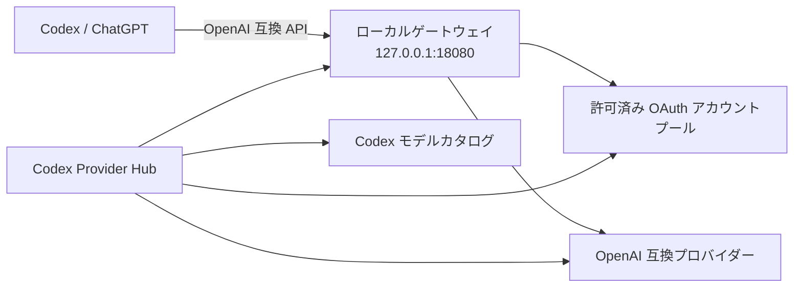

<p align="center">
  
</p>

<p align="center">
  <a href="README.md">English</a> ·
  <a href="README.zh-CN.md">简体中文</a> ·
  <a href="README.ja.md"><strong>日本語</strong></a>
</p>

<p align="center">
  <a href="https://github.com/ningsam/codex-provider-hub/actions/workflows/ci.yml"></a>
  <a href="LICENSE"></a>
  
  <a href="https://github.com/ningsam/codex-provider-hub/stargazers"></a>
</p>

# Codex Provider Hub

**Codex のプロバイダー、OAuth アカウントプール、モデルルーティング、利用枠を一元管理する、ローカルファーストの macOS コントロールセンターです。**

Codex Provider Hub は、ローカルの [Sub2API](https://github.com/Wei-Shaw/sub2api) 環境をネイティブなメニューバーダッシュボードから操作できるようにします。ゲートウェイの起動・停止、OpenAI 互換プロバイダーの追加、アカウントごとの利用枠確認、ChatGPT のモデルピッカー保護、Cursor やリレーサービスの利用状況確認を、認証情報をクラウドの管理画面へ送らずに行えます。

> [!IMPORTANT]
> 本プロジェクトは初期段階で、現在は macOS を主な対象としています。現時点ではソースからのビルドが必要で、署名済みダウンロード版は[ロードマップ](ROADMAP.md)に含まれています。
>
> 本プロジェクトは非公式のコミュニティプロジェクトであり、OpenAI、ChatGPT、Cursor、AIHub、Sub2API からの承認・提携を受けたものではありません。自分が所有している、または管理権限を持つアカウントとプロバイダーのみを使用してください。

## プレビュー

<p align="center">
  
</p>

ドキュメントは英語・簡体字中国語・日本語に対応しています。アプリ内の英語・日本語ローカライズは次の主要マイルストーンです。

## このプロジェクトが解決すること

ローカルのマルチプロバイダー環境では、Shell スクリプト、Docker、設定ファイル、アカウント管理画面、モデルカタログに操作が分散しがちです。Codex Provider Hub はそれらを一つの可視化ワークスペースへまとめ、機密データは Mac の中に保持します。

| 機能 | 得られるもの |
| --- | --- |
| **ローカルゲートウェイ制御** | 既定の `127.0.0.1:18080` Sub2API ゲートウェイを起動・停止・更新し、ヘルスチェックできます。 |
| **プロバイダー追加** | OpenAI 互換アップストリームを追加し、モデルを検出して、プレフィックス付き ID を Codex カタログへ同期します。 |
| **OAuth アカウントプール** | 許可済みの OpenAI/Codex OAuth アカウントを取り込み、アカウントごとの 5 時間 / 7 日間の利用枠を確認します。 |
| **モデルピッカーガード** | `use_hidden_models` を修復し、host rules を使って ChatGPT を起動することで、リモート設定による上書きを抑えます。 |
| **リレー利用状況** | AIHub の残高と当日の使用量を同じダッシュボードで確認します。 |
| **Cursor アカウント表示** | ローカルの Cursor セッション、または許可済みトークンを追加し、プラン利用量をアカウント別に確認します。 |
| **メニューバーワークフロー** | アプリを常駐させ、macOS のメニューバー項目の直下にダッシュボードを開きます。 |

## 構成



Codex Provider Hub はコントロール層です。ローカルのルーティング層である Sub2API は別途インストールします。

## 必要環境

- macOS 11 以降。主なテスト対象は Apple Silicon
- [Node.js](https://nodejs.org/) 20 以降
- [Rust](https://rustup.rs/) stable
- `./sub2api` 管理スクリプトを含む、動作済みのローカル Sub2API 環境
- モデルピッカーガードの任意依存: Python 3 と `plyvel`（推奨される LevelDB パッチ経路に使用）

## クイックスタート

```bash
git clone https://github.com/ningsam/codex-provider-hub.git
cd codex-provider-hub
npm install

# ローカルの Sub2API インストール先を指定します。
export SUB2API_DIR="$HOME/path/to/your/sub2api-ready"

# 開発モードでデスクトップアプリを起動します。
npm run tauri dev
```

ローカルアプリをビルドする場合:

```bash
npm run tauri build
```

macOS の出力先:

```text
src-tauri/target/release/bundle/macos/Codex Provider Hub.app
src-tauri/target/release/bundle/dmg/*_aarch64.dmg
```

<details>
<summary><strong>設定リファレンス</strong></summary>

| データソース | 認証情報またはパス |
| --- | --- |
| Sub2API ディレクトリ | `SUB2API_DIR` または `CODEX_PROVIDER_HUB_SUB2API_DIR`。未指定時は `$HOME/Documents/Codex/sub2api-ready` |
| ゲートウェイ API Key | `$SUB2API_DIR/state/gateway-api-key` |
| Sub2API 管理者 | `$SUB2API_DIR/.env` の `ADMIN_EMAIL` と `ADMIN_PASSWORD` |
| AIHub Key | Sub2API の AIHub アカウント、アプリ内保存 Key、`ANYROUTER_API_KEY` / `~/.zshrc` の順で参照 |
| Codex 設定 | `~/.codex/config.toml` と Codex model catalog JSON |
| Cursor Token | アプリデータディレクトリへ暗号化保存、または Cursor のローカル `state.vscdb` からインポート |

</details>

<details>
<summary><strong>OpenAI 互換プロバイダーを追加する</strong></summary>

1. ローカルゲートウェイが healthy であることを確認するか、Sub2API ディレクトリで `./sub2api up` を実行します。
2. Codex Provider Hub の **Providers** を開き、**Add** を選択します。
3. 表示名、Base URL、API Key、モデルプレフィックスを入力します。
4. 必要であれば先にモデルを検出し、その後プロバイダーを追加して同期します。
5. Hub は Sub2API の `apikey` アカウントを作成し、バックアップ後に Codex カタログを更新します。
6. Codex で `{prefix}-{model}` を選択します。リクエストは引き続き `http://127.0.0.1:18080/v1` を通ります。

Sub2API の URL allowlist が有効で `502 host not allowed` が発生する場合は、アップストリームホストを `SECURITY_URL_ALLOWLIST_UPSTREAM_HOSTS` に追加し、コンテナを force-recreate してください。

</details>

<details>
<summary><strong>モデルピッカーガードについて</strong></summary>

ChatGPT デスクトップアプリは、動的設定によって非公式のモデル slug を隠すことがあります。任意のガード機能は次の処理を行います。

1. ローカルストレージの Statsig `use_hidden_models` を `false` に設定します。
2. host rules 付きで ChatGPT を再起動し、値がリモートから上書きされる可能性を下げます。

この機能は第三者ソフトウェアの内部実装に依存するため、アップストリーム更新後に動作しなくなる可能性があります。使用前に変更内容を確認し、バックアップを保持してください。

</details>

## セキュリティモデル

- API Key をリポジトリのソースコードへハードコードしません。
- Cursor と AIHub のカスタム認証情報は AES-256-GCM で暗号化して保存します。
- プロバイダー認証情報はローカルの検出処理または Sub2API 設定にのみ使用し、ブラウザストレージへ保存しません。
- Codex 設定と model catalog を変更する前にバックアップします。
- 機密性のある報告は [SECURITY.md](SECURITY.md) に従ってください。公開 Issue に API Key、OAuth token、JWT、未編集の `.env` を投稿しないでください。

本ツールは許可済みリソースを表示・ルーティングするもので、プロバイダーの利用枠や利用規約を回避するものではありません。

## ロードマップ

直近の優先事項は、ダウンロード可能な macOS ビルド、初回セットアップの改善、アプリ内の英語・中国語・日本語対応、診断情報のエクスポート、プロバイダーのヘルス履歴です。詳細は [ROADMAP.md](ROADMAP.md) を参照してください。

## コントリビューション

パッケージング、ローカライズ、ドキュメント、プロバイダー互換性、macOS テストへの貢献を歓迎します。Pull Request を作成する前に [CONTRIBUTING.md](CONTRIBUTING.md) を確認してください。

バグ報告と機能提案には、リポジトリの [Issue テンプレート](https://github.com/ningsam/codex-provider-hub/issues/new/choose) を利用してください。

## プロジェクトを応援する

Codex Provider Hub がローカル環境の管理に役立った場合は、リポジトリへの Star を検討してください。プロジェクトを必要とする開発者が見つけやすくなり、今後の優先順位を判断する材料にもなります。

## License

[MIT License](LICENSE) の下で公開しています。
