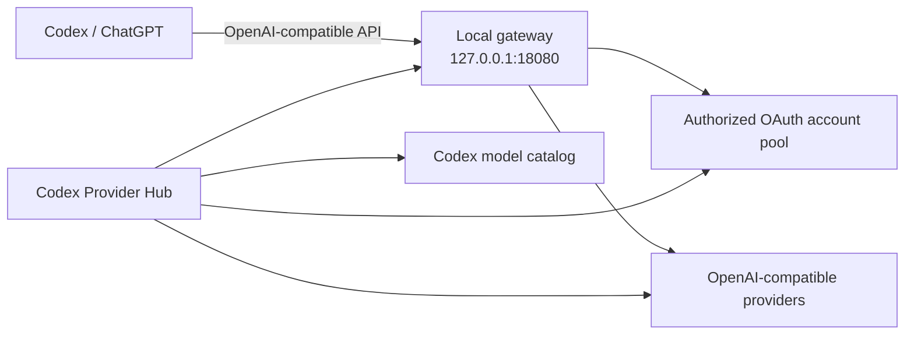

<p align="center">
  
</p>

<p align="center">
  <a href="README.md"><strong>English</strong></a> ·
  <a href="README.zh-CN.md">简体中文</a> ·
  <a href="README.ja.md">日本語</a>
</p>

<p align="center">
  <a href="https://github.com/ningsam/codex-provider-hub/actions/workflows/ci.yml"></a>
  <a href="LICENSE"></a>
  
  <a href="https://github.com/ningsam/codex-provider-hub/stargazers"></a>
</p>

# Codex Provider Hub

**A local-first macOS control center for Codex providers, OAuth account pools, model routing, and live usage quotas.**

Codex Provider Hub wraps a local [Sub2API](https://github.com/Wei-Shaw/sub2api) deployment in a native menu-bar dashboard. Start or stop the gateway, add OpenAI-compatible providers, monitor account quotas, keep the ChatGPT model picker usable, and inspect Cursor or relay usage without sending credentials to a hosted control plane.

> [!IMPORTANT]
> This project is early-stage and macOS-first. It currently builds from source; downloadable signed releases are on the [roadmap](ROADMAP.md).
>
> This is an unofficial community project and is not affiliated with or endorsed by OpenAI, ChatGPT, Cursor, AIHub, or Sub2API. Use only accounts and providers you own or are authorized to manage.

## Preview

<p align="center">
  
</p>

Documentation is available in English, Simplified Chinese, and Japanese. In-app English/Japanese localization is one of the next milestones.

## Why this exists

A local multi-provider setup usually spreads control across shell scripts, Docker, configuration files, account dashboards, and model catalogs. Codex Provider Hub brings those operations into one visible workspace while keeping sensitive data on your Mac.

| Capability | What it gives you |
| --- | --- |
| **Local gateway control** | Start, stop, refresh, and health-check the default `127.0.0.1:18080` Sub2API gateway. |
| **Provider onboarding** | Add OpenAI-compatible upstreams, probe their models, and sync prefixed model IDs into the Codex catalog. |
| **OAuth account pool** | Import authorized OpenAI/Codex OAuth accounts and inspect per-account 5-hour / 7-day quota windows. |
| **Model picker guard** | Repair `use_hidden_models` and optionally launch ChatGPT with host rules that reduce remote configuration overrides. |
| **Relay visibility** | Track AIHub balance and daily usage from the same dashboard. |
| **Cursor account view** | Import the local Cursor session or add authorized tokens and inspect plan usage per account. |
| **Menu-bar workflow** | Keep the app out of the way and open the dashboard directly beneath the macOS menu-bar item. |

## How it fits together



Codex Provider Hub is the control layer. Sub2API remains the local routing layer and is installed separately.

## Requirements

- macOS 11 or later; Apple Silicon is the primary tested target
- [Node.js](https://nodejs.org/) 20 or later
- [Rust](https://rustup.rs/) stable
- A working local Sub2API deployment with its `./sub2api` management script
- Optional for the model picker guard: Python 3 and `plyvel` for the preferred LevelDB patch path

## Quick start

```bash
git clone https://github.com/ningsam/codex-provider-hub.git
cd codex-provider-hub
npm install

# Point the Hub at your local Sub2API installation.
export SUB2API_DIR="$HOME/path/to/your/sub2api-ready"

# Start the desktop app in development mode.
npm run tauri dev
```

Build a local application bundle with:

```bash
npm run tauri build
```

Expected macOS outputs:

```text
src-tauri/target/release/bundle/macos/Codex Provider Hub.app
src-tauri/target/release/bundle/dmg/*_aarch64.dmg
```

<details>
<summary><strong>Configuration reference</strong></summary>

| Data source | Credential or path |
| --- | --- |
| Sub2API directory | `SUB2API_DIR` or `CODEX_PROVIDER_HUB_SUB2API_DIR`; otherwise `$HOME/Documents/Codex/sub2api-ready` |
| Gateway API key | `$SUB2API_DIR/state/gateway-api-key` |
| Sub2API admin | `ADMIN_EMAIL` and `ADMIN_PASSWORD` in `$SUB2API_DIR/.env` |
| AIHub key | Sub2API AIHub account first; then the in-app stored key; then `ANYROUTER_API_KEY` / `~/.zshrc` fallback |
| Codex configuration | `~/.codex/config.toml` plus the Codex model catalog JSON |
| Cursor token | Encrypted in the app data directory or imported from Cursor's local `state.vscdb` |

</details>

<details>
<summary><strong>Adding an OpenAI-compatible provider</strong></summary>

1. Confirm that the local gateway is healthy, or run `./sub2api up` inside your Sub2API directory.
2. Open **Providers** in Codex Provider Hub and choose **Add**.
3. Enter a display name, Base URL, API key, and model prefix.
4. Probe first if desired, then add the provider and sync its models.
5. The Hub creates the Sub2API `apikey` account and updates the Codex catalog after making a backup.
6. Select `{prefix}-{model}` in Codex; requests continue through `http://127.0.0.1:18080/v1`.

If Sub2API URL allowlisting is enabled and you receive `502 host not allowed`, add the upstream host to `SECURITY_URL_ALLOWLIST_UPSTREAM_HOSTS` and force-recreate the container.

</details>

<details>
<summary><strong>About the model picker guard</strong></summary>

The ChatGPT desktop app can dynamically hide non-official model slugs. The optional guard can:

1. Set Statsig `use_hidden_models` to `false` in local storage.
2. Relaunch ChatGPT with host rules that reduce the chance of the value being overwritten remotely.

This behavior depends on implementation details of third-party software and may break after upstream updates. Review changes before use and keep backups.

</details>

## Security model

- API keys are not hardcoded in the repository.
- Custom Cursor and AIHub credentials are encrypted at rest with AES-256-GCM.
- Provider credentials are used for local probe or Sub2API configuration requests and are not stored in browser storage.
- Codex configuration and model catalog files are backed up before modification.
- Sensitive reports should follow [SECURITY.md](SECURITY.md); never paste API keys, OAuth tokens, JWTs, or unredacted `.env` files into public issues.

This tool displays and routes authorized resources; it does not bypass provider quotas or terms.

## Roadmap

Near-term priorities include downloadable macOS builds, smoother first-run setup, in-app English/Chinese/Japanese localization, diagnostics export, and richer provider health history. See [ROADMAP.md](ROADMAP.md) for the maintained plan.

## Contributing

Contributions are welcome, especially around packaging, localization, documentation, provider compatibility, and macOS testing. Read [CONTRIBUTING.md](CONTRIBUTING.md) before opening a pull request.

For bugs and feature requests, use the repository's structured [issue templates](https://github.com/ningsam/codex-provider-hub/issues/new/choose).

## Support the project

If Codex Provider Hub makes your local setup easier, consider giving the repository a star. It helps other developers discover the project and shows which direction is worth maintaining.

## License

Released under the [MIT License](LICENSE).
