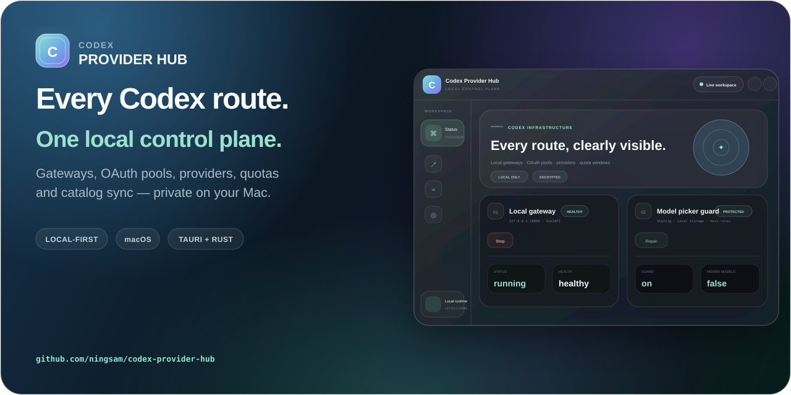
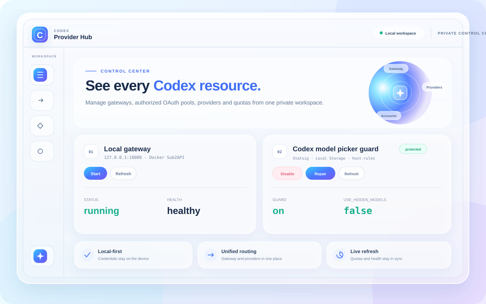
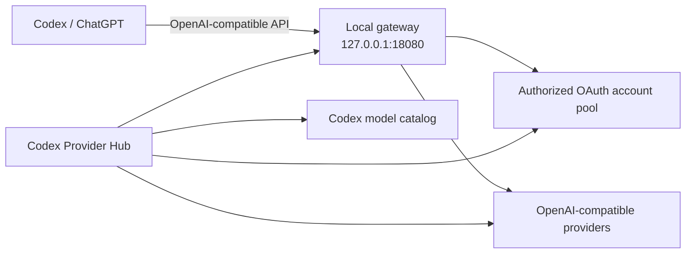

<p align="center">
  
</p>

<p align="center">
  <a href="README.md"><strong>English</strong></a> ·
  <a href="README.zh-CN.md">简体中文</a> ·
  <a href="README.ja.md">日本語</a>
</p>

<p align="center">
  <a href="https://github.com/ningsam/codex-provider-hub/actions/workflows/ci.yml"></a>
  <a href="https://github.com/ningsam/codex-provider-hub/releases"></a>
  <a href="LICENSE"></a>
  
  <a href="https://github.com/ningsam/codex-provider-hub/stargazers"></a>
</p>

# Codex Provider Hub

**A local-first macOS control plane for Codex providers, OAuth account pools, model routing, and live usage quotas.**

Codex Provider Hub wraps a local [Sub2API](https://github.com/Wei-Shaw/sub2api) deployment in a native menu-bar workspace. Start or stop the gateway, add OpenAI-compatible providers, inspect account quotas, keep the ChatGPT model picker usable, and monitor Cursor or relay usage without sending credentials to a hosted dashboard.

<p align="center">
  <a href="https://github.com/ningsam/codex-provider-hub/releases"><strong>Download the macOS preview</strong></a>
  ·
  <a href="#build-from-source">Build from source</a>
</p>

> [!IMPORTANT]
> This is an early macOS-first preview. Release artifacts are ad-hoc signed but are not yet Apple-notarized, so macOS may ask you to approve the app in **System Settings → Privacy & Security**.
>
> This is an unofficial community project and is not affiliated with or endorsed by OpenAI, ChatGPT, Cursor, AIHub, or Sub2API. Use only accounts and providers you own or are authorized to manage.

## Preview

<p align="center">
  
</p>

## Why this exists

A local multi-provider setup usually spreads control across shell scripts, Docker, configuration files, account dashboards, and model catalogs. Codex Provider Hub brings those operations into one visible workspace while keeping sensitive data on your Mac.

| Capability | What it gives you |
| --- | --- |
| **Local gateway control** | Start, stop, refresh, and health-check the default `127.0.0.1:18080` Sub2API gateway. |
| **Provider onboarding** | Add OpenAI-compatible upstreams, probe models, and sync prefixed model IDs into the Codex catalog. |
| **OAuth account pool** | Import authorized OpenAI/Codex OAuth accounts and inspect per-account 5-hour / 7-day quota windows. |
| **Model picker guard** | Repair local `use_hidden_models` state and optionally relaunch ChatGPT with protective host rules. |
| **Relay visibility** | Track AIHub balance and daily usage from the same dashboard. |
| **Cursor account view** | Import the local Cursor session or add authorized tokens and inspect plan usage per account. |
| **Native menu-bar workflow** | Open a compact, transparent liquid-glass workspace directly beneath the macOS menu-bar item. |

## Install the preview

1. Open [GitHub Releases](https://github.com/ningsam/codex-provider-hub/releases).
2. Download the `.dmg` matching your Mac:
   - `aarch64` for Apple Silicon
   - `x86_64` for Intel
3. Move **Codex Provider Hub.app** to Applications.
4. Point the app at an existing local Sub2API installation with `SUB2API_DIR` or `CODEX_PROVIDER_HUB_SUB2API_DIR`.

The preview is ad-hoc signed. If macOS blocks the first launch, open **System Settings → Privacy & Security** and choose **Open Anyway**. Checksums are published with every automated release in `SHA256SUMS.txt`.

## How it fits together



Codex Provider Hub is the control layer. Sub2API remains the local routing layer and is installed separately.

## Requirements

- macOS 11 or later
- An existing local Sub2API deployment with its `./sub2api` management script
- Optional for the model picker guard: Python 3 and `plyvel` for the preferred LevelDB patch path
- Node.js 20+ and Rust stable only when building from source

## Build from source

```bash
git clone https://github.com/ningsam/codex-provider-hub.git
cd codex-provider-hub
npm install

export SUB2API_DIR="$HOME/path/to/your/sub2api-ready"
npm run tauri dev
```

Create a local bundle with:

```bash
npm run tauri build
```

<details>
<summary><strong>Configuration reference</strong></summary>

| Data source | Credential or path |
| --- | --- |
| Sub2API directory | `SUB2API_DIR` or `CODEX_PROVIDER_HUB_SUB2API_DIR`; otherwise `$HOME/Documents/Codex/sub2api-ready` |
| Gateway API key | `$SUB2API_DIR/state/gateway-api-key` |
| Sub2API admin | `ADMIN_EMAIL` and `ADMIN_PASSWORD` in `$SUB2API_DIR/.env` |
| AIHub key | Sub2API AIHub account first; then the in-app stored key; then `ANYROUTER_API_KEY` / `~/.zshrc` fallback |
| Codex configuration | `~/.codex/config.toml` plus the Codex model catalog JSON |
| Cursor token | Encrypted in the app data directory or imported from Cursor's local `state.vscdb` |

</details>

<details>
<summary><strong>Adding an OpenAI-compatible provider</strong></summary>

1. Confirm that the local gateway is healthy, or run `./sub2api up` inside your Sub2API directory.
2. Open **Providers** in Codex Provider Hub and choose **Add**.
3. Enter a display name, Base URL, API key, and model prefix.
4. Probe first if desired, then add the provider and sync its models.
5. The Hub creates the Sub2API `apikey` account and updates the Codex catalog after making a backup.
6. Select `{prefix}-{model}` in Codex; requests continue through `http://127.0.0.1:18080/v1`.

If Sub2API URL allowlisting is enabled and you receive `502 host not allowed`, add the upstream host to `SECURITY_URL_ALLOWLIST_UPSTREAM_HOSTS` and force-recreate the container.

</details>

<details>
<summary><strong>About the model picker guard</strong></summary>

The ChatGPT desktop app can dynamically hide non-official model slugs. The optional guard can set Statsig `use_hidden_models` to `false` in local storage and relaunch ChatGPT with host rules that reduce remote overwrites. This depends on third-party implementation details and may break after upstream updates; review changes and keep backups.

</details>

## Security model

- API keys are not hardcoded in the repository.
- Custom Cursor and AIHub credentials are encrypted at rest with AES-256-GCM.
- Provider credentials are used for local probe or Sub2API configuration requests and are not stored in browser storage.
- Codex configuration and model catalog files are backed up before modification.
- Sensitive reports should follow [SECURITY.md](SECURITY.md); never paste API keys, OAuth tokens, JWTs, or unredacted `.env` files into public issues.

This tool displays and routes authorized resources; it does not bypass provider quotas or terms.

## Release and quality pipeline

- Every pull request runs the TypeScript/Vite build and an Apple Silicon native Tauri bundle check.
- Pushing the maintained `release` branch builds both Apple Silicon and Intel bundles.
- Release assets are published as a GitHub prerelease with SHA-256 checksums.
- Developer ID signing and Apple notarization remain the next distribution milestone.

See [CHANGELOG.md](CHANGELOG.md) and [ROADMAP.md](ROADMAP.md).

## Contributing

Contributions are welcome, especially around packaging, localization, onboarding, provider compatibility, and macOS testing. Read [CONTRIBUTING.md](CONTRIBUTING.md) before opening a pull request.

For bugs and feature requests, use the repository's structured [issue templates](https://github.com/ningsam/codex-provider-hub/issues/new/choose).

## Support the project

If Codex Provider Hub makes your local setup easier, consider giving the repository a star. It helps other developers discover the project and shows which direction is worth maintaining.

## License

Released under the [MIT License](LICENSE).
