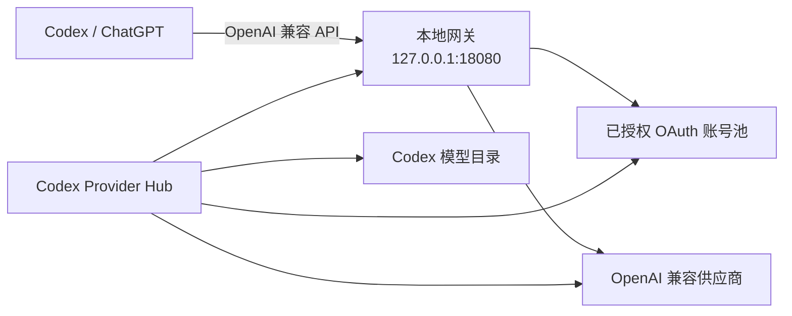

<p align="center">
  
</p>

<p align="center">
  <a href="README.md">English</a> ·
  <a href="README.zh-CN.md"><strong>简体中文</strong></a> ·
  <a href="README.ja.md">日本語</a>
</p>

<p align="center">
  <a href="https://github.com/ningsam/codex-provider-hub/actions/workflows/ci.yml"></a>
  <a href="https://github.com/ningsam/codex-provider-hub/releases"></a>
  <a href="LICENSE"></a>
  
  <a href="https://github.com/ningsam/codex-provider-hub/stargazers"></a>
</p>

# Codex Provider Hub

**一个本地优先的 macOS 控制中心，用来管理 Codex 供应商、OAuth 账号池、模型路由与实时额度。**

Codex Provider Hub 为本地 [Sub2API](https://github.com/Wei-Shaw/sub2api) 部署提供原生菜单栏工作区。你可以在一个界面中启停网关、添加 OpenAI 兼容供应商、查看账号额度、维持 ChatGPT 模型选择器可用，并检查 Cursor 或中转站用量，而不需要把凭据交给云端控制台。

<p align="center">
  <a href="https://github.com/ningsam/codex-provider-hub/releases"><strong>下载 macOS 预览版</strong></a>
  ·
  <a href="#从源码构建">从源码构建</a>
</p>

> [!IMPORTANT]
> 项目仍处于早期阶段，以 macOS 为主。下载产物采用 ad-hoc 签名，但尚未经过 Apple notarization；首次打开时可能需要在**系统设置 → 隐私与安全性**中批准。
>
> 本项目是非官方社区项目，与 OpenAI、ChatGPT、Cursor、AIHub 或 Sub2API 均无隶属或背书关系。请仅管理你本人拥有或已获授权使用的账号与供应商。

## 界面预览

<p align="center">
  
</p>

## 为什么需要它

本地多供应商环境通常分散在 Shell 脚本、Docker、配置文件、账号后台和模型目录中。Codex Provider Hub 把这些操作集中到一个可视化工作区，同时让敏感数据继续留在你的 Mac 上。

| 能力 | 你可以得到什么 |
| --- | --- |
| **本地网关控制** | 启动、停止、刷新并检查默认 `127.0.0.1:18080` Sub2API 网关。 |
| **供应商接入** | 添加 OpenAI 兼容上游、探测模型，并把带前缀的模型 ID 同步到 Codex catalog。 |
| **OAuth 账号池** | 导入已获授权的 OpenAI/Codex OAuth 账号，查看每个账号的 5 小时 / 7 天额度窗口。 |
| **模型选择器守护** | 修复本地 `use_hidden_models` 状态，并可通过 host rules 重新启动 ChatGPT。 |
| **中转站可视化** | 在同一看板查看 AIHub 余额与当日消耗。 |
| **Cursor 多账号视图** | 导入本机 Cursor 会话或添加已授权 token，逐账号查看套餐用量。 |
| **原生菜单栏工作流** | 点击菜单栏项目后，直接展开紧凑、透明的液态玻璃工作区。 |

## 安装预览版

1. 打开 [GitHub Releases](https://github.com/ningsam/codex-provider-hub/releases)。
2. 下载与你的 Mac 匹配的 `.dmg`：
   - Apple Silicon 选择 `aarch64`
   - Intel 选择 `x86_64`
3. 将 **Codex Provider Hub.app** 拖入“应用程序”。
4. 通过 `SUB2API_DIR` 或 `CODEX_PROVIDER_HUB_SUB2API_DIR` 指向已有的本地 Sub2API 安装目录。

预览版使用 ad-hoc 签名。如愜首次启动被 macOS 拦截，请进入**系统设置 → 隐私与安全性**并选择**仍要打开**。每次自动发布都会附带 `SHA256SUMS.txt`。

## 工作原理



Codex Provider Hub 是控制层；Sub2API 仍然是本地路由层，需要单独安装。

## 环境要求

- macOS 11 或更高版本
- 已部署并可用的本地 Sub2API，且带有 `./sub2api` 管理脚本
- 模型选择器守护可选依赖：Python 3 与 `plyvel`
- 只有从源码构建时才需要 Node.js 20+ 与 Rust stable

## 从源码构建

```bash
git clone https://github.com/ningsam/codex-provider-hub.git
cd codex-provider-hub
npm install

export SUB2API_DIR="$HOME/path/to/your/sub2api-ready"
npm run tauri dev
```

构建本地应用：

```bash
npm run tauri build
```

<details>
<summary><strong>配置参考</strong></summary>

| 数据源 | 凭据或路径 |
| --- | --- |
| Sub2API 安装目录 | `SUB2API_DIR` 或 `CODEX_PROVIDER_HUB_SUB2API_DIR`；否则默认 `$HOME/Documents/Codex/sub2api-ready` |
| 网关 API Key | `$SUB2API_DIR/state/gateway-api-key` |
| Sub2API Admin | `$SUB2API_DIR/.env` 中的 `ADMIN_EMAIL` 与 `ADMIN_PASSWORD` |
| AIHub Key | 优先读取 Sub2API AIHub 账号；其次为应用内保存的 Key；再次为 `ANYROUTER_API_KEY` / `~/.zshrc` |
| Codex 配置 | `~/.codex/config.toml` 与 Codex model catalog JSON |
| Cursor Token | 加密保存在应用数据目录，也可从 Cursor 本地 `state.vscdb` 导入 |

</details>

<details>
<summary><strong>添加 OpenAI 兼容供应商</strong></summary>

1. 确认本地网关健康，或在 Sub2API 目录中运行 `./sub2api up`。
2. 打开 **供应商**页面，点击**添加**。
3. 填写显示名、Base URL、API Key 与模型前缀。
4. 可先探测模型，再添加供应商并同步模型。
5. Hub 会创建 Sub2API `apikey` 账号，并在备份后更新 Codex catalog。
6. 在 Codex 中选择 `{prefix}-{model}`；请求仍通过 `http://127.0.0.1:18080/v1`。

若开启 URL 白名单并出现 `502 host not allowed`，请把上游域名加入 `SECURITY_URL_ALLOWLIST_UPSTREAM_HOSTS`，然后 force-recreate 容器。

</details>

## 安全模型

- API Key 不会硬编码到仓库源码中。
- 自定义 Cursor 与 AIHub 凭据使用 AES-256-GCM 加密落盘。
- 供应商凭据仅用于本地探测或配置 Sub2API，不会写入浏览器存储。
- 修改 Codex 配置和 model catalog 前会自动备份。
- 敏感漏洞请按照 [SECURITY.md](SECURITY.md) 报告；不要在公开 Issue 中粘贴 API Key、OAuth token、JWT 或未脱敏 `.env` 文件。

本工具只展示和路由已获授权的资源，不会绕过供应商额度或服务条款。

## 发布与质量流程

- 每个 Pull Request 都会执行 TypeScript/Vite 构建和 Apple Silicon 原生 Tauri 打包检查。
- 推送维护中的 `release` 分支时，会同时构建 Apple Silicon 与 Intel 版本。
- 构建产物会作为 GitHub prerelease 发布，并附带 SHA-256 校验值。
- Developer ID 正式签名与 Apple 公证仍是下一阶段目标。

详见 [CHANGELOG.md](CHANGELOG.md) 与 [ROADMAP.md](ROADMAP.md)。

## 参与贡献

欢迎提交贡献，尤其是打包发布、多语言、首次设置、供应商兼容性和 macOS 测试。提交 Pull Request 前请阅读 [CONTRIBUTING.md](CONTRIBUTING.md)。

Bug 与功能建议请使用仓库的结构化 [Issue 模板](https://github.com/ningsam/codex-provider-hub/issues/new/choose)。

## 支持项目

如果 Codex Provider Hub 确实让你的本地环境更容易管理，可以给仓库一个 Star。它能帮助更多开发者发现项目，也能让维护方向更清晰。

## License

项目采用 [MIT License](LICENSE)。
